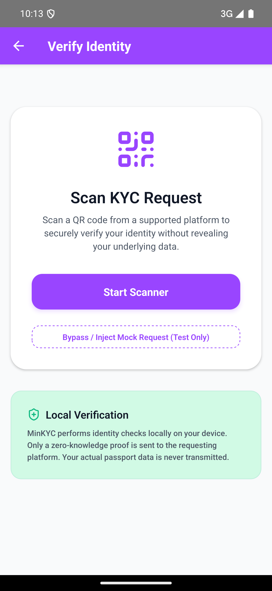
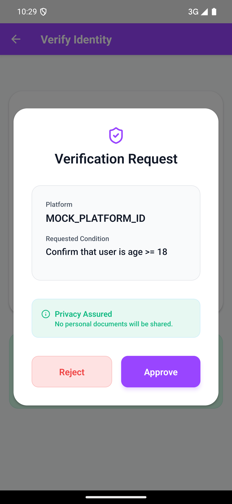

# MinKYC — Privacy-Preserving KYC on Solana

[](https://solanamobile.radiant.nexus/)
[](https://opensource.org/licenses/MIT)

**MinKYC is the privacy-first compliance layer built for the Solana Seeker.**

It enables dApps to verify user constraints (e.g., Age > 18, EU Resident) using on-device NFC passport scanning and Zero-Knowledge proofs, completely eliminating the need for centralized platforms to store toxic PII (Personally Identifiable Information).

---

## 📱 The Mobile Experience (Solana Seeker)

The MinKYC Solana Seeker app is the core of the ecosystem. It turns a user's phone into a self-sovereign identity vault.

| Scan ePassport | Zero-Knowledge Proof | Audit Log |
| :---: | :---: | :---: |
|  |  |  |

*   **Local Data Extraction**: Reads NFC ePassports directly into the Seeker's secure environment.
*   **Zero-Knowledge Proofs**: Proves constraints locally without revealing the underlying data.
*   **On-Chain Receipts**: Anchors immutable proof receipts to the Solana blockchain.

---

## 🌐 The MinKYC Ecosystem

MinKYC is not just an app; it is a complete, decoupled architecture for the future of compliance.

1.  **The Seeker App**: The consumer-facing mobile wallet for managing identity and generating proofs locally.
2.  **The CLI Tooling**: Infrastructure for platforms and regulators to request proofs and audit compliance.
3.  **The OSINT Intelligence Feed**: An autonomous AI agent that monitors global news for centralized KYC data breaches, highlighting the urgent need for ZK solutions. 
    * 🔗 **[Explore the MinKYC Website & Breach Tracker](https://getoutofthatgarden.github.io/minkyc-website/)**

---

## 🚀 Quick Start (Running the App)

The mobile app is located in `mobile/App` and is built with React Native.

```bash
git clone https://github.com/GetOutOfThatGarden/MinKYC.git
cd MinKYC/mobile/App
npm install
```

### Running on a Physical Android Device (Recommended for NFC)
1. **Enable Developer Mode**: Go to Settings > About phone > Build number (tap 7 times) and enable **USB Debugging**.
2. **Connect**: Plug your phone into your Mac.
3. **Forward Port**: Run `adb reverse tcp:8081 tcp:8081` to link the Metro bundler.
4. **Launch**:
   ```bash
   npm run android
   ```

*Note: You can use the **Mock Profiles** in the Scan screen to test scenarios immediately if you do not have an NFC ePassport handy.*

---

## 🛠️ Developer Tools & CLI Ecosystem

The MVP includes shell scripts that simulate the complete KYC workflow from three different perspectives.

First, set up the project root:
```bash
cd MinKYC
npm install
```

### 1. User — Create Identity
Creates an identity by scanning a passport (mocked NFC read) and uploading a cryptographic commitment to Solana.
```bash
./user.sh init
```

### 2. Platform — Verify User
The platform requests KYC verification and submits proof in one step.
```bash
./platform.sh verify --over-18
```

### 3. Regulator — Audit Verification
The regulator checks that proper KYC verification was performed by looking up the transaction.
```bash
./regulator.sh check
```

*(See the `cli/` directory for advanced direct commands).*

---

## 🏗️ Technical Architecture

### Identity Storage
* Each identity is stored in a Program Derived Address (PDA) on Solana.
* Seeded by: `["identity", owner_pubkey, index]`

### Commitment & Replay Protection
* `commitment = SHA256(passport_data || secret_nonce)`
* Only the commitment is stored on-chain. Raw identity data **never** leaves the user's device.
* Each proof creates a unique `ProofReceipt` PDA on-chain to prevent double-spending/replay attacks.

### Smart Contract Features
* ✅ **Identity Commitments** — Store only cryptographic hashes.
* ✅ **Replay Protection** — Immutable proof receipts.
* ✅ **Events** — Pushed for indexers and real-time monitoring.

---

## 🎥 Demo Video

**Watch the original 5-minute CLI demo:** https://www.loom.com/share/9dced184732f48e0b754a2ad7c822687

*(The video shows the foundational CLI. The mobile app UI screenshots above demonstrate the latest Seeker experience).*

---

## 🏆 Hackathon Submissions

This project was built for:
- 🥇 **Solana Seeker: Monolith Track** (March 2026)
- **Colosseum Agent Hackathon** (Feb 2026) — [Project Page](https://colosseum.com/agent-hackathon/projects/minkyc-e5qc5l)

**Program ID (Devnet):** `9zzT4KdUh7TEtiR8ioTMhDLWDa4c6ymzAjQsYYfvc3h1`
**AgentWallet Default Address:** `AmhTt5Cfk69MUi3q1ySwHn6mndUHJ1gD3Boi5ngWd2BS`

---

## License

MIT License. See `LICENSE` for details.
